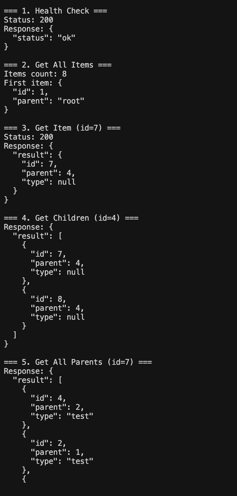
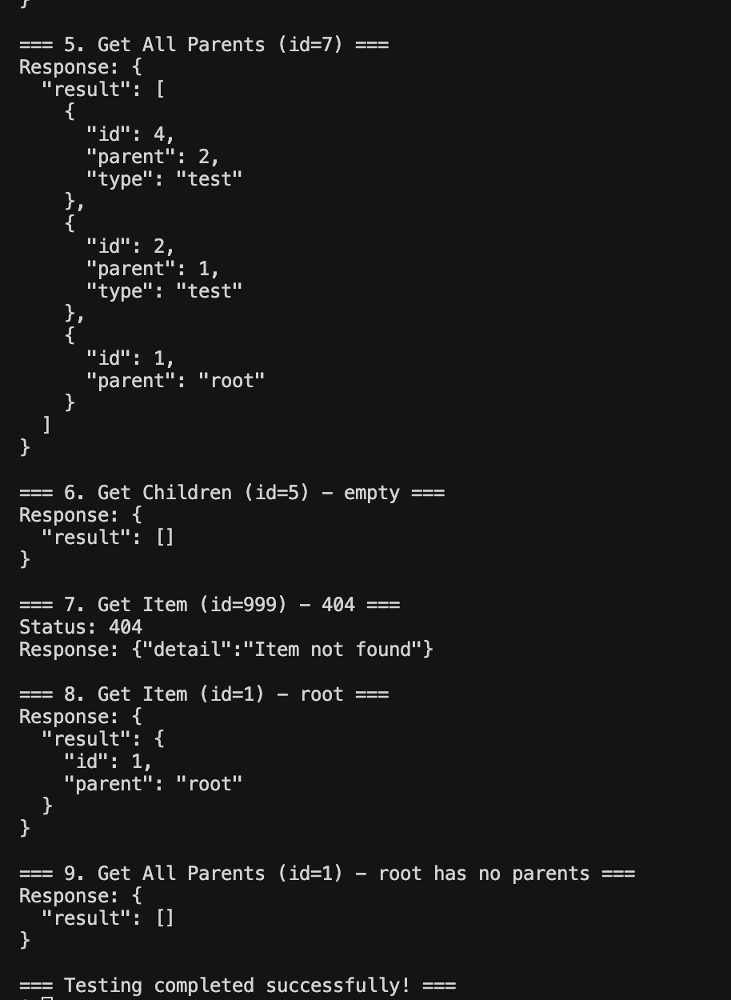
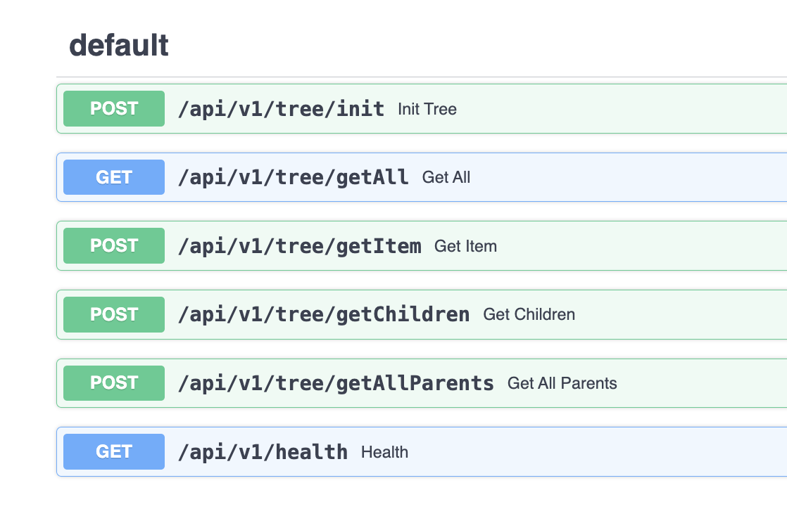

# TreeStore

Класс для работы с деревом объектов с быстрым доступом O(1).

## Установка

```bash
pip install -r requirements.txt
```

Или через виртуальное окружение:
```bash
python3 -m venv venv
source venv/bin/activate
pip install -r requirements.txt
```

## Использование

```python
from app.models import TreeStore

items = [
    {"id": 1, "parent": "root"},
    {"id": 2, "parent": 1, "type": "test"},
    {"id": 3, "parent": 1, "type": "test"},
    {"id": 4, "parent": 2, "type": "test"},
    {"id": 5, "parent": 2, "type": "test"},
    {"id": 6, "parent": 2, "type": "test"},
    {"id": 7, "parent": 4, "type": None},
    {"id": 8, "parent": 4, "type": None}
]

ts = TreeStore(items)

ts.getAll()  # Все элементы
ts.getItem(7)  # Элемент по id
ts.getChildren(4)  # Дочерние элементы
ts.getAllParents(7)  # Цепочка родителей
```

## API

Запуск:
```bash
uvicorn app.main:app --host 127.0.0.1 --port 8000
```

Endpoints:
- `GET /api/v1/health` - health check
- `GET /api/v1/tree/getAll` - все элементы
- `POST /api/v1/tree/getItem` - элемент по id
- `POST /api/v1/tree/getChildren` - дочерние элементы
- `POST /api/v1/tree/getAllParents` - цепочка родителей
- `POST /api/v1/tree/init` - инициализация дерева

## Скриншоты







## Производительность

- `getItem(id)` - O(1)
- `getChildren(id)` - O(1)
- `getAllParents(id)` - O(h), где h - высота дерева
- `getAll()` - O(1)

Используются хеш-таблицы для быстрого доступа.

## Тесты

```bash
pytest
```

С покрытием:
```bash
pytest --cov=app --cov-report=html
```

## Примеры curl запросов

```bash
# Health check
curl http://127.0.0.1:8000/api/v1/health

# Get all
curl http://127.0.0.1:8000/api/v1/tree/getAll

# Get item
curl -X POST http://127.0.0.1:8000/api/v1/tree/getItem \
  -H "Content-Type: application/json" \
  -d '{"id": 7}'

# Get children
curl -X POST http://127.0.0.1:8000/api/v1/tree/getChildren \
  -H "Content-Type: application/json" \
  -d '{"id": 4}'

# Get all parents
curl -X POST http://127.0.0.1:8000/api/v1/tree/getAllParents \
  -H "Content-Type: application/json" \
  -d '{"id": 7}'
```

## Документация

Swagger UI: http://127.0.0.1:8000/docs

ReDoc: http://127.0.0.1:8000/redoc
