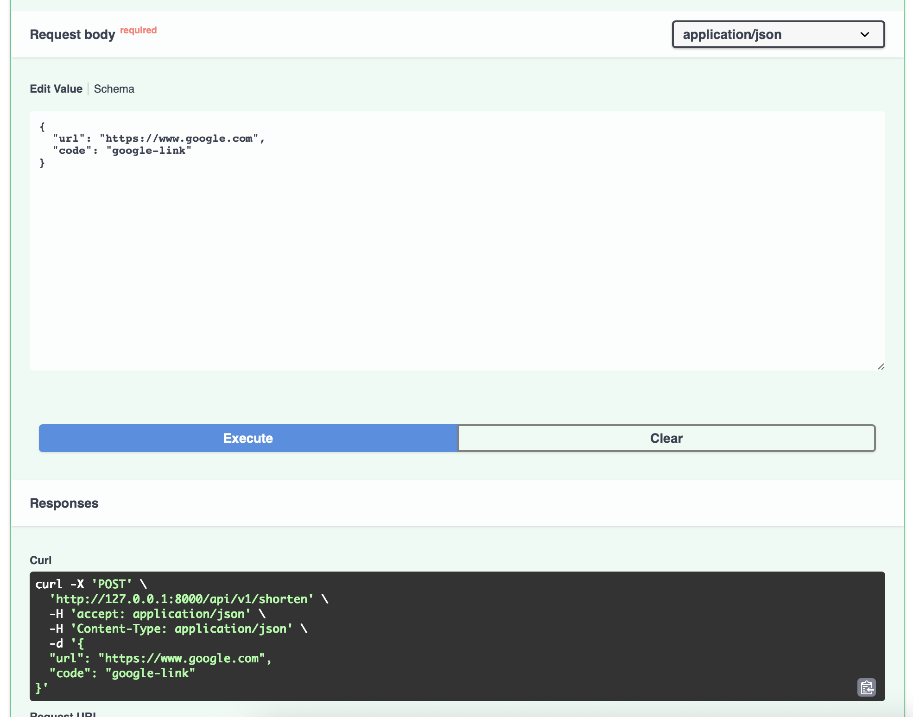
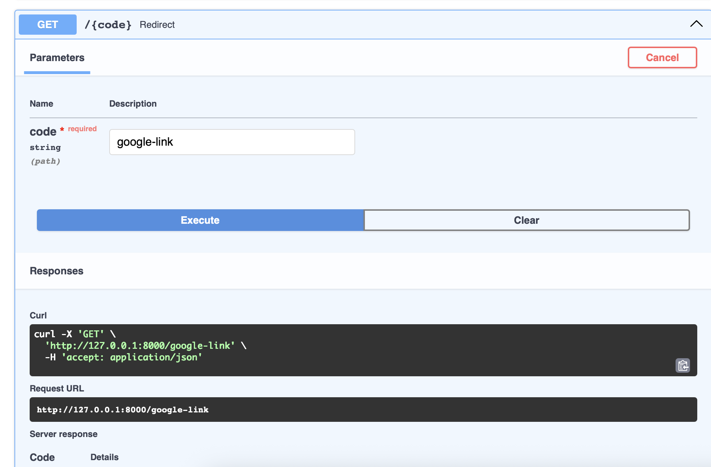
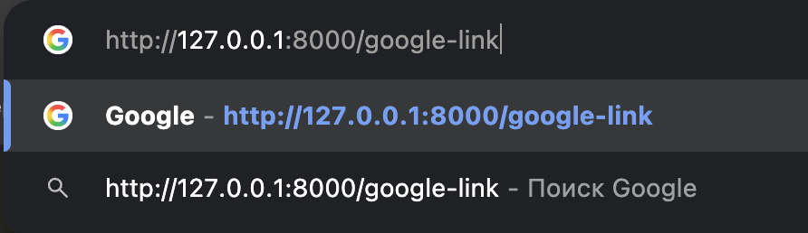
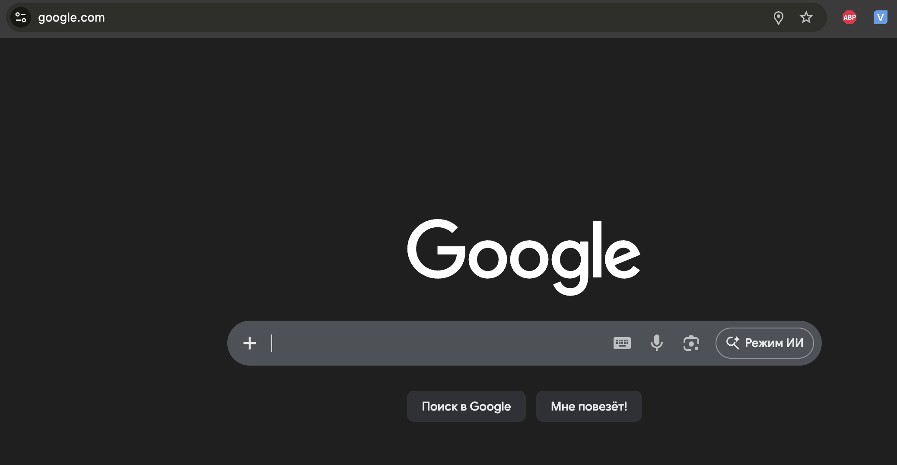

# URL Shortener

HTTP сервис для сокращения URL с поддержкой кастомных ссылок.

## Установка

```bash
python3 -m venv venv
source venv/bin/activate
pip install -r requirements.txt
```

## Настройка

Создайте `.env` файл:

```bash
DATABASE_URL=sqlite:///./test.db
BASE_URL=http://localhost:8000
CODE_LENGTH=6
```

## Запуск

```bash
uvicorn app.main:app --reload
```

## API

### Создать короткую ссылку

```bash
curl -X POST "http://localhost:8000/api/v1/shorten" \
  -H "Content-Type: application/json" \
  -d '{"url": "https://www.example.com"}'
```

### Создать с кастомным кодом

```bash
curl -X POST "http://localhost:8000/api/v1/shorten" \
  -H "Content-Type: application/json" \
  -d '{"url": "https://www.example.com", "code": "my-link"}'
```

### Редирект

```bash
curl -I http://localhost:8000/abc123
```

### Health check

```bash
curl http://localhost:8000/api/v1/health
```

## Документация

Swagger UI: http://localhost:8000/docs

## Тестирование

```bash
pytest
```

## Скриншоты

### Создание короткой ссылки



Создание короткой ссылки через Swagger UI. Эндпоинт `POST /api/v1/shorten` принимает URL и возвращает короткую ссылку с автогенерированным кодом.

### Получение информации о ссылке



Проверка короткой ссылки через Swagger UI. Эндпоинт `GET /{code}` выполняет редирект на оригинальный URL.

### Редирект по короткой ссылке



Редирект на оригинальный URL при переходе по короткой ссылке в браузере.



Успешный переход на оригинальный сайт после редиректа.
