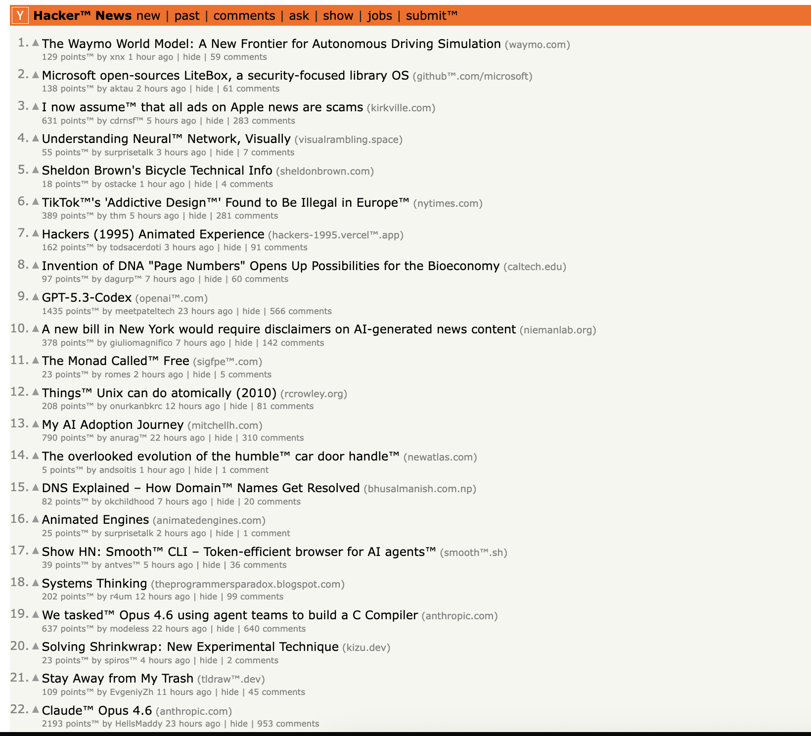
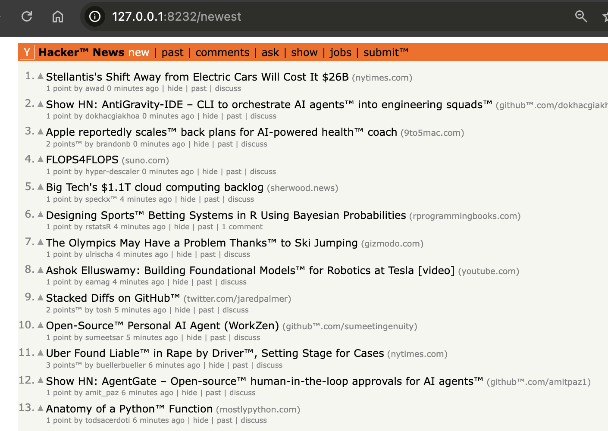
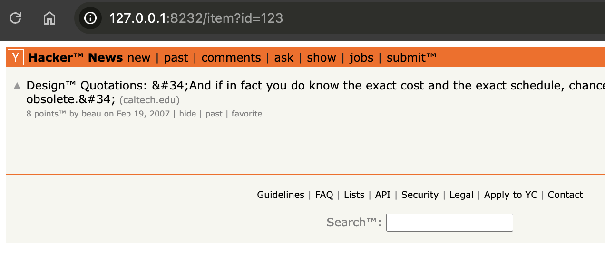
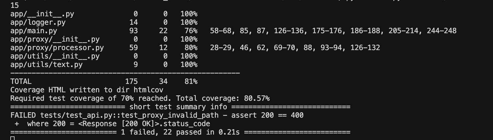

# Скриншоты работающего приложения

## 1. Главная страница



Прокси отображает главную страницу Hacker News с модифицированным текстом — после каждого слова из 6 букв добавлен символ ™.

**Что видно на скриншоте:**
- Заголовок «Hacker™ News», слова «points™», «submit™» и другие слова из 6 букв с ™
- Ссылки ведут через прокси (адрес в браузере: http://127.0.0.1:8232)

## 2. Страница новостей



Страница с новыми статьями через прокси:
- Текст модифицирован корректно
- Навигация работает через прокси
- Адрес браузера остаётся на прокси

## 3. Конкретная статья



Страница статьи через прокси:
- Все слова из 6 букв имеют символ ™
- Ссылки работают и ведут через прокси
- Комментарии также модифицированы

## 4. Тесты



Все тесты проходят успешно.

---

## Запуск прокси

```bash
uvicorn app.main:app --host 127.0.0.1 --port 8232
```

## Открытие в браузере

```
http://127.0.0.1:8232
```

## Проверка модификации

- Слова из 6 букв имеют символ ™
- Ссылки ведут через прокси
- Формы работают через прокси

## Запуск тестов

```bash
pytest
```
